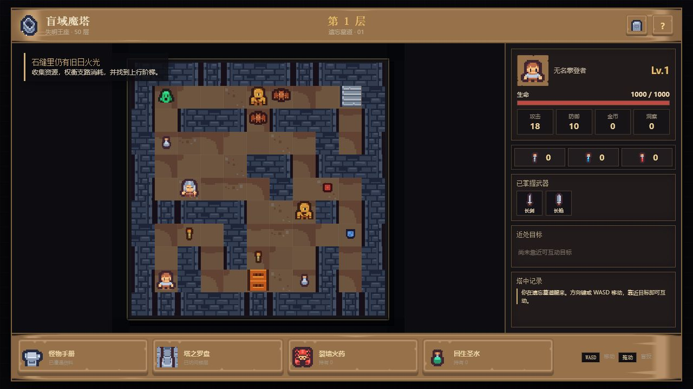
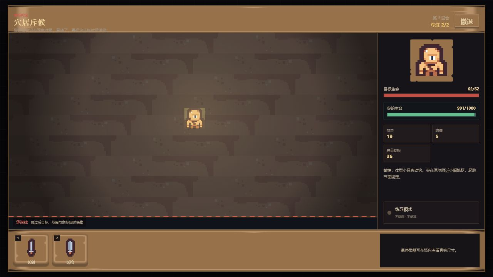

# 盲域魔塔：失明王座

一款可直接在浏览器游玩的 2D 固定数值魔塔 RPG。探索采用经典格子地图、钥匙门、商店、NPC、道具与 50 层固定塔图；战斗改为原创的“盲域命中”机制。

## 在线试玩

[打开游戏](https://magick47.github.io/blind-tower/)

建议使用桌面浏览器。方向键或 `WASD` 移动；战斗时先观察目标，再从底部拖出武器范围。跨过承诺线后，目标、范围与鼠标会同时隐藏，松手结算命中。





## 本地运行

```bash
npm install
npm run dev
```

构建检查：

```bash
npm run build
```

## 美术资源

游戏使用 Kenney 的 Tiny Dungeon 与 UI Pack: RPG Expansion 素材，相关 CC0 许可文件随资源保存在 `public/assets/LICENSE-KENNEY-*.txt`。

核心系统的持续设计记录见 `core-system-design.html`。
