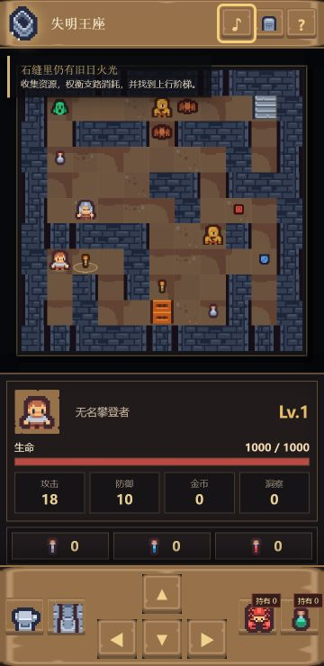

# 失明王座：五十层魔塔

一款可直接在浏览器游玩的 2D 固定数值魔塔 RPG。游戏包含经典格子地图、钥匙门、商店、NPC、道具与 50 层固定塔图；战斗采用可提前计算战损的传统魔塔规则。

## 在线试玩

[打开游戏](https://magick47.github.io/blind-tower/)

桌面端使用方向键或 `WASD` 移动，也可以点击地图，按点击位置相对勇者的主方向走一步。手机竖屏提供固定在最下方的加大方向键和常用工具，按住方向键可以连续移动。接敌前会显示准确战损，战斗自动进行，也可以立即完成演出。右上角音符按钮可以随时开关游戏音效。




## 本地运行

```bash
npm install
npm run dev
```

构建检查：

```bash
npm run build
```

## 美术资源

游戏使用 Kenney 的 Tiny Dungeon 与 UI Pack: RPG Expansion 素材，相关 CC0 许可文件随资源保存在 `public/assets/LICENSE-KENNEY-*.txt`。

游戏音效来自项目方持有许可的本地素材库，并已转换为网页游戏使用的 MP3；来源说明见 `public/assets/audio/SOURCE.md`。

## 难度与成长

当前平衡按每 5 层一个难度台阶设计。第 5、15、25、35、45 层是封印守卫，第 10、20、30、40、50 层是章节首领；同一段内的主路怪、支路怪与守卫也会逐层增强。

- 勇者初始为 800 生命、18 攻击、10 防御；升级只增加 80 生命、2 攻击、1 防御，避免中期滚雪球。
- 每个五层商店只允许强化 3 次，单次提供 4 攻击、4 防御或 160 最大生命，且全局购买价格持续递增。
- 高塔圣水恢复 360 生命或 30% 最大生命，取较高值，使后期回复仍有价值但不会抬高最大生命。
- 只走主路且完全不拿资源会在第 7 层受阻；会比较战损、回收药水并按下一段敌人配装的路线可以通关。
- 本次规则使用 v2 存档槽，旧版原型存档不会混入新的平衡曲线。

核心系统的持续设计记录见 `core-system-design.html`。

平衡回归检查：

```bash
npm run balance
```

它会模拟直冲、正常探索、规划路线和清图路线，并校验每个五层段与十场关底战的战损递增、规划路线可通关及最终余血区间。
